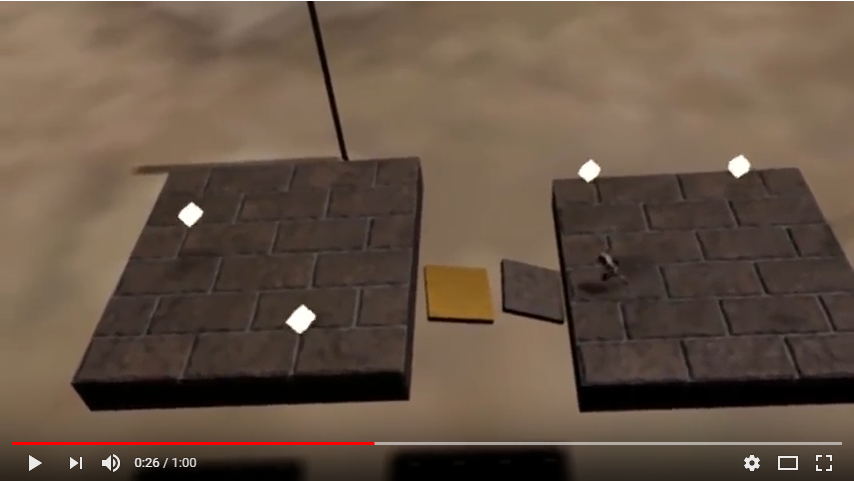
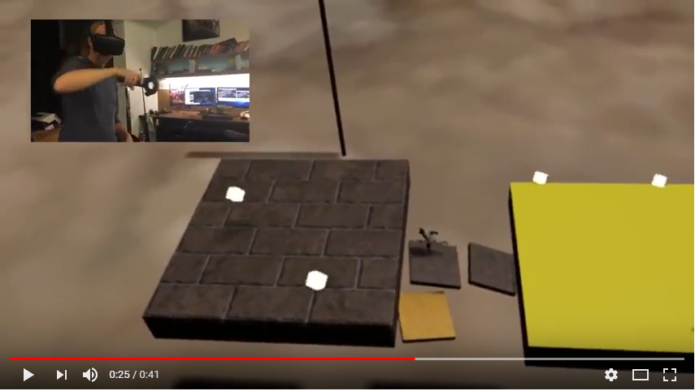

# Hand of God

## TRAILER

## GAMEPLAY TRAILER

You are running from the encroaching Darkness of a dying world. Your path is hard to see and disintegrating. Creatures emerge from the shadows to drag you into the Darkness. Fortunately a God has decided to help you, but no God is perfect. How long can you last?

Hand of God is an asymmetric co-op game. One player is the ‘Runner’, and uses a traditional game controller to move and stay ahead of the Darkness that swirls around along the dangerous path. If the Runner cannot move forward fast enough, the darkness envelops them for a grim end. The other player is the ‘God’, trying to help the Runner last as long as possible. This is a God, however, who needs the Runner's help. The Runner collects resources that enable the God to generate and place items to help the Runner, such as blocks to cross gaps in the world, and fending off creatures that emerge from the shadows. The God is immersed into the world of the runner via the HTC Vive and has a broader sense of the world itself.

## Contributors:

### [Aman Sachan](http://amansachan.com/)
### [Jon Lee](http://jonlee.xyz/)
### [Michael Stauffer](https://github.com/mgstauffer)

#### [Documentation](Documentation_Hand_Of_God.pdf)

###

